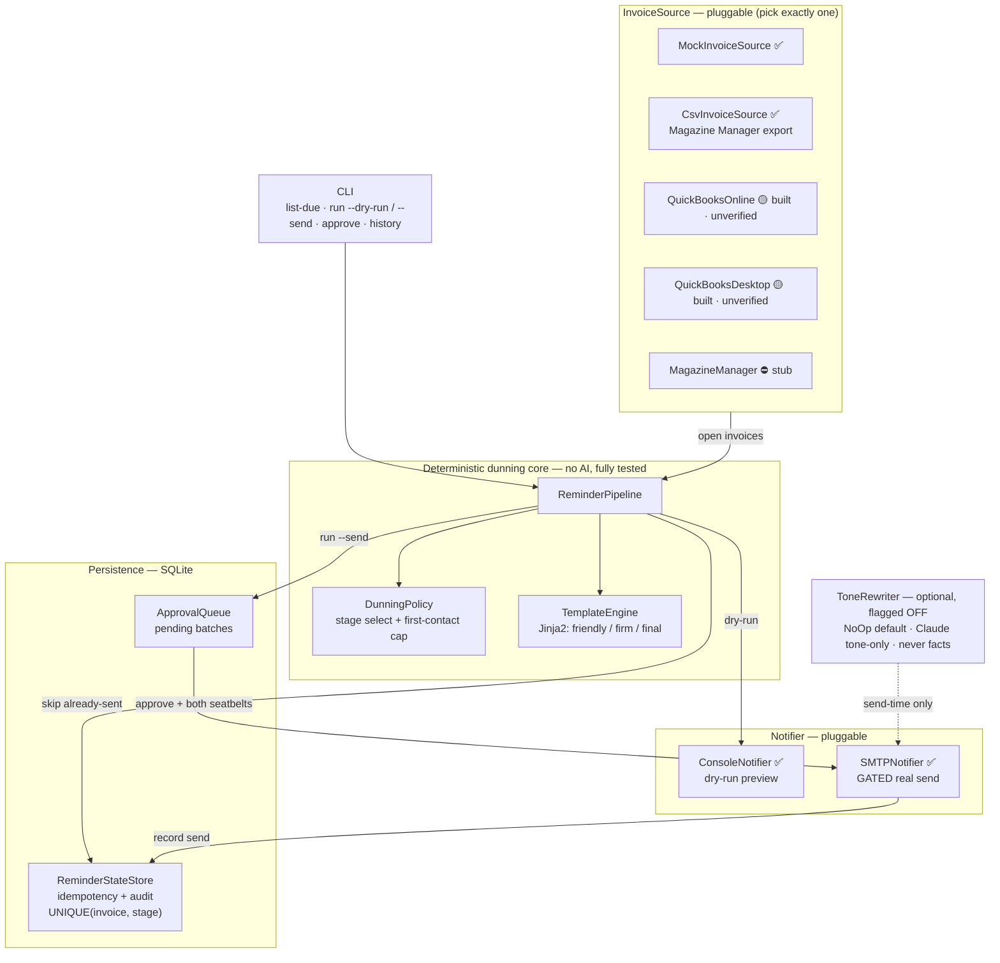
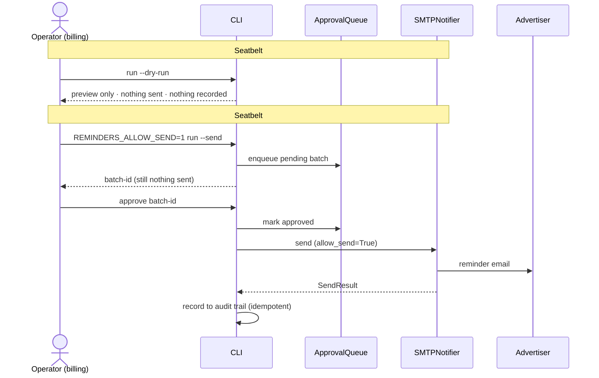

# Invoice Reminders — automated dunning for a magazine publisher

A small, well-tested **workflow-automation (RPA)** tool that finds overdue
advertiser invoices and sends staged payment reminders ("dunning"), replacing a
staffer who does it by hand.

> **This is a deterministic RPA problem, not an LLM problem.** Who gets billed,
> what they owe, and the reminder schedule are decided by plain, testable code.
> An LLM is an *optional, isolated* enhancement for message **tone only** —
> feature-flagged OFF, and never in the path that selects invoices, amounts, or
> stages.

**It runs today with no credentials.** Point it at a CSV export of your open
invoices (or the built-in mock fixtures) and it shows exactly what it *would* send
— nothing leaves without explicit human approval. The **recommended deployment is
deliberately small**: a single scheduled job (cron / launchd / Task Scheduler) —
either **fully automated** (`cron-run` auto-sends the routine lane and holds the
risky slice for a human) or **manual-approve** — one runtime, one SQLite file. The QuickBooks Online /
Desktop adapters are **blueprinted and unit-tested but not verified against a live
tenant** (and QuickBooks Desktop additionally needs a SOAP host that isn't in this
repo) — build exactly one, for real, once you confirm where the data lives. An
**optional** n8n workflow is included for shops that already run n8n
(see ["Running on a schedule"](#running-on-a-schedule-cron-first-n8n-optional)).

---

## 🚨 v1 REQUIRES HUMAN APPROVAL BEFORE ANY REAL SEND 🚨

**Nothing money-touching leaves the building automatically.** There are two
independent seatbelts, and a real email is impossible unless *both* are engaged:

1. **Dry-run is the default.** Every command that could send defaults to a
   preview. You must explicitly `run --send` to *stage* a batch, and then
   explicitly `approve <batch-id>` to release it.
2. **A second seatbelt env var.** `run --send` and `approve` both refuse unless
   `REMINDERS_ALLOW_SEND=1` is set in the environment.

`run --send` only **enqueues** reminders into an approval queue — it sends
nothing. The `SMTPNotifier` (the one component that talks to a mail server) is
unreachable in dry-run and additionally refuses, in code, to transmit unless it
was explicitly constructed with `allow_send=True` after approval. If you do
nothing, nobody gets emailed.

---

## Architecture

The data source and the notifier are **pluggable** behind clean interfaces. The
deterministic dunning core (`policy` + `templates` + `pipeline` + `state`) does
not know or care where invoices come from or how a message is delivered.



### The "nothing sends without approval" flow

Two independent seatbelts gate every real send — dry-run is the default, and a
real email is impossible unless **both** are engaged:



**Source is pluggable; everything downstream is done.** The deterministic core is
finished and tested against `MockInvoiceSource`. Three real sources are built:
`CsvInvoiceSource` (runnable **today** against a Magazine Manager AR export — the
no-credentials MVP) and both QuickBooks adapters (built and unit-tested offline, **not
yet verified against a live tenant** — and QuickBooks Desktop additionally needs a
SOAP host that isn't in this repo, so build exactly one, for real, after the source
is confirmed). Going live is a one-line config change
(`source.kind`); the policy, templates, state store, approval flow, and notifiers
do not change.

### Components

| Component | File | Status |
|---|---|---|
| `Invoice` / `Reminder` / `SendResult` models | `src/reminders/models.py` | ✅ |
| `InvoiceSource` interface | `src/reminders/sources/base.py` | ✅ |
| `MockInvoiceSource` (reads JSON fixture) | `src/reminders/sources/mock.py` | ✅ |
| `CsvInvoiceSource` (Magazine Manager AR export) | `src/reminders/sources/csv_source.py` | ✅ |
| `QuickBooksOnlineSource` (REST / OAuth2) | `src/reminders/sources/quickbooks_online.py` | 🟡 built · unverified |
| `QuickBooksDesktopSource` (qbXML / Web Connector) | `src/reminders/sources/quickbooks_desktop.py` | 🟡 built · unverified |
| `MagazineManagerSource` (browser automation) | `src/reminders/sources/magazine_manager.py` | ⛔ stub |
| `DunningPolicy` (stage selection — deterministic core) | `src/reminders/policy.py` | ✅ |
| `TemplateEngine` (Jinja2, friendly/firm/final) | `src/reminders/templates.py` | ✅ |
| `ReminderStateStore` (SQLite idempotency + audit) | `src/reminders/state.py` | ✅ |
| `ApprovalQueue` (SQLite pending batches) | `src/reminders/approval.py` | ✅ |
| `ReminderPipeline` (portable orchestration) | `src/reminders/pipeline.py` | ✅ |
| `ConsoleNotifier` / `SMTPNotifier` | `src/reminders/notifiers/` | ✅ |
| `ToneRewriter` (isolated LLM seam — flagged OFF) | `src/reminders/tone.py` | ✅ |
| CLI | `src/reminders/cli.py` | ✅ |

---

## Quick start

```bash
# 1. Install (a virtualenv is recommended)
pip install -e .            # or: pip install pydantic PyYAML Jinja2 python-dotenv

# 2. Config (optional — the CLI falls back to config.example.yaml if absent)
cp config.example.yaml config.yaml
cp .env.example .env

# 3. See what WOULD be sent right now, against the mock fixtures.
#    --as-of pins the date so the seeded invoices land on documented stages.
PYTHONPATH=src python -m reminders.cli --as-of 2026-06-05 list-due

# 4. Preview the actual emails (DRY-RUN — sends nothing, records nothing)
PYTHONPATH=src python -m reminders.cli --as-of 2026-06-05 run --dry-run

# 5. Stage a real send for approval (needs the seatbelt; still sends nothing)
REMINDERS_ALLOW_SEND=1 PYTHONPATH=src python -m reminders.cli --as-of 2026-06-05 run --send
#    -> prints a batch-id

# 6. Release the batch (this is the ONLY step that can email; needs the seatbelt)
REMINDERS_ALLOW_SEND=1 PYTHONPATH=src python -m reminders.cli approve <batch-id>

# 7. Audit trail of everything sent, to whom, when, with message hashes
PYTHONPATH=src python -m reminders.cli history
```

(After `pip install -e .`, a `reminders` console script is available, so you can
drop the `PYTHONPATH=src python -m reminders.cli` prefix.)

### Point it at your own invoices (no credentials)

Export your overdue invoices from the billing system as a CSV (a Magazine Manager
AR/aging export works as-is — the importer is forgiving about headers, `$`/comma
amounts, and US-or-ISO dates), then set the source to `csv` in `config.yaml`:

```yaml
source:
  kind: "csv"
  csv_path: "my_overdue_invoices.csv"      # or fixtures/magazine_manager_ar_export_sample.csv
```

```bash
reminders list-due            # same flow as above, now against your real data
reminders run --dry-run       # preview the actual emails
```

To send for real, fill in `smtp` + `SMTP_USERNAME`/`SMTP_PASSWORD` (a Gmail **app
password**, not your login), set `REMINDERS_ALLOW_SEND=1`, then `run --send` and
`approve <batch-id>`. For a real backlog, also set `dunning.first_contact_stage_cap:
"friendly"` so long-overdue invoices don't open with a FINAL notice.

### CLI commands

| Command | What it does | Sends? |
|---|---|---|
| `list-due` | Lists invoices due for a reminder now, and at which stage. Read-only. | No |
| `run --dry-run` *(default)* | Renders the real emails and prints them via `ConsoleNotifier`. Records nothing. | No |
| `run --send` | Enqueues reminders into the `ApprovalQueue` as a pending batch; prints a summary + batch-id. Requires `REMINDERS_ALLOW_SEND=1`. Refuses a risky cold start (see below) unless capped or `--allow-cold-start`. | No |
| `approve <batch-id>` | Releases an approved batch to the `SMTPNotifier`, then records each send to the state store. Requires `REMINDERS_ALLOW_SEND=1`. | **Yes** |
| `history [--invoice ID]` | Dumps the audit trail (invoice, stage, sent-at, channel, recipient, batch, message hash). | No |
| `batches [--cancel ID]` | Lists staged approval batches and their status; `--cancel` discards a pending batch (a canceled batch can never be sent). | No |
| `cron-run [--dry-run]` | Unattended: auto-sends the routine lane, diverts final/high-value/first-contact to the human queue, behind fail-closed guards. Needs `automation.enabled` + `REMINDERS_ALLOW_SEND=1`. `--dry-run` sends nothing. | **Yes** |

> Add `--json` to any command (before or after the subcommand) for one
> machine-readable JSON object on stdout — that's the surface the n8n workflow and
> any script consume.
>
> **Cold-start safety.** The first `run --send` against a real source (csv /
> quickbooks_\*) with an empty audit trail and no `first_contact_stage_cap` is
> **refused** — otherwise a long-overdue backlog would open with FINAL notices. Set
> the cap (recommended) or pass `--allow-cold-start` to acknowledge.

---

## The dunning policy (config-driven)

Stages are defined entirely in `config.yaml` — thresholds, tone tiers, and the
sender identity are **not** hardcoded.

| Stage | Default trigger | Tone |
|---|---|---|
| `friendly` | +1 day overdue | gentle nudge |
| `firm` | +14 days overdue | clear, businesslike |
| `final` | +30 days overdue | final notice |

**Selection rule (deterministic):** an invoice is placed in the highest stage
"bucket" it currently qualifies for, and that stage is sent **once, ever**. A
lower stage already having gone out does *not* block a higher one — that is the
intended escalation as an invoice ages.

**Stop conditions:** invoice is `paid` or `void`, `do_not_contact` is set, the
invoice isn't overdue enough for any stage, or the current bucket's stage has
already been sent.

**First-contact cap (cold-start / backlog safety, optional).** The first time you
point this at a real billing system you inherit a backlog of invoices that are
already badly overdue but have never been contacted *by this tool*. Without a cap,
their very first email would be a "FINAL NOTICE." Set `dunning.first_contact_stage_cap`
to a stage name (e.g. `friendly`) and the **first-ever** reminder for any invoice
is held down to that stage; it escalates to its true age-bucket on later runs. The
cap can only ever *lower* the first touch, never raise it. It ships **off** (so the
mock demo still shows `friendly`/`firm`/`final`) — **turn it on for production.**

**Idempotency.** A `UNIQUE(invoice_id, stage)` constraint makes the *audit record*
exactly-once: the same (invoice, stage) can never be **recorded** twice, even if the
job runs repeatedly or crashes. On the wire it is **at-least-once by deliberate
choice** — `approve` sends, *then* records; a crash in the small window after SMTP
accepts a message but before we record it would re-send that one reminder on the
next run. For debt collection that's the safe direction (a rare duplicate nudge
beats a silently-unsent chase). The rendered body is SHA-256 hashed and stored, so a
re-run can prove it already sent *this exact* message.

---

## The optional AI tone-rewrite (deliberately isolated)

This project's thesis is that dunning is a **deterministic RPA problem, not an LLM
problem** — *who* gets billed, *how much*, and *which stage* are decided by plain,
tested code. The one place an LLM is allowed is **message tone**, and it is fenced
off so it can never affect a billing decision:

- **Off by default** (`tone_rewrite.enabled: false`). With it off, the whole
  system is deterministic and `anthropic` isn't even imported.
- **Body copy only.** It rephrases the already-rendered email body in the stage's
  tone — it never sees or changes the amount, the stage, or the recipient.
- **Send-time, never in dry-run.** Previews stay byte-identical; the rewrite runs
  only after human approval, on the actual send.
- **Cached + idempotent.** Each rewrite is cached per `(invoice, stage)` keyed on
  the source-body hash, so a retry/re-approve sends identical bytes and the audit
  records the hash of what was *actually* delivered.
- **Fact-preservation guard.** After the model returns, the code verifies the
  rewrite still contains the invoice number and the amount; if not, it **falls back
  to the deterministic copy.** The LLM can never cause a send missing those facts.

See `src/reminders/tone.py` and `tests/test_tone.py`. This is what lets the tool
honestly answer "*is one autonomous AI tool safe for this?*" with: **no — a custom
stack where the AI is confined to the edges and a human stays on the trigger.**

---

## OPEN QUESTION — pick the data source

The real billing system is **Magazine Manager**, which has **no public API**. The
remaining decision isn't *code* — the sources are built — it's a **fact-finding**
one: where does the overdue list actually come from? Four paths, best to last resort:

| Path | Transport / Auth | Status | When it's the answer |
|---|---|---|---|
| **CSV export** (`csv_source.py`) | A human exports the AR/aging report; we ingest the file. No API, no credentials, no bots. | ✅ runnable | Fastest, lowest-risk MVP — works whether or not QuickBooks is involved |
| **QuickBooks Online** (`quickbooks_online.py`) | REST, **OAuth2** (Intuit app: client_id/secret, refresh token, company `realmId`) | 🟡 built | Magazine Manager syncs to the **cloud** QuickBooks product |
| **QuickBooks Desktop** (`quickbooks_desktop.py`) | **qbXML/SOAP** via the **Web Connector** (we host a SOAP endpoint; customer imports a `.qwc`) | 🟡 built | Magazine Manager syncs to **on-premise** QuickBooks Desktop |
| **Magazine Manager** (`magazine_manager.py`) | **No public API** — supervised browser automation against the logged-in UI (brittle) | ⛔ stub | Billing lives *only* in Magazine Manager and there is no QuickBooks sync |

### Exact facts we need before writing any adapter

1. **Does the publisher use QuickBooks at all?** If billing is entered/managed in
   Magazine Manager, **does it sync/export to QuickBooks?** (If yes, integrate
   with QuickBooks and avoid scraping entirely — strongly preferred.)
2. **If QuickBooks: Online or Desktop?** This picks QBO (OAuth2/REST) vs QBD
   (qbXML/Web Connector) — completely different integrations.
3. **For QBO:** can we register an Intuit developer app and obtain OAuth2
   credentials + the company `realmId`? Sandbox first?
4. **For QBD:** which Windows machine hosts QuickBooks, and may we install the
   Web Connector and point it at a SOAP endpoint we host? What is its poll
   cadence?
5. **Where do customer *emails* live?** QuickBooks customer records sometimes
   lack a billing email; we may need a supplementary contact source.

> Magazine Manager has **no public API**. We will not invent endpoints.
> That adapter stays a stub unless browser automation becomes the only option.

---

## Running on a schedule (cron first, n8n optional)

One small publisher, one runtime, nothing extra to host. Two ways to schedule it —
**fully automated** (recommended for hands-off), or **manual approval** (most
conservative). Both via plain cron; no second system.

### Fully automated — `reminders cron-run`

A daily cron stages, sends the **routine lane**, and **diverts the irreversible
slice to a human** — all unattended. This is the answer to "can it just run itself?"
*Yes — for the routine majority; the dangerous slice keeps a person, by design.*

```bash
# crontab: weekday mornings. Ships OFF (automation.enabled: false) — flip on after the canary.
0 8 * * 1-5  cd /opt/invoice-reminder && REMINDERS_ALLOW_SEND=1 reminders cron-run >> cron.log 2>&1
```

| Auto-sends unattended | Diverted to the human `approve` queue |
|---|---|
| `friendly` / `firm` stages, amount ≤ `max_auto_amount`, advertiser **already** contacted | **every `final` notice**, any high-value balance, **first-ever** contact to a new advertiser |

**The split is enforced in code, not just config** (`reminders.automation`): no
`config.yaml` edit can route a final notice or a balance over **$2,500** into the
auto lane. Because no human reviews each send, the guards *are* the safety — every
one **fails closed** (refuses the whole run + alerts, never a partial blast):

- **kill switch** — `automation.enabled` must be true *and* `REMINDERS_ALLOW_SEND=1`; drop a `HOLD` file to pause everything instantly;
- **freshness** — refuses to dun off a CSV older than `csv_max_age_hours` (a stale export silently escalating paid invoices is the #1 risk);
- **required cap** — `first_contact_stage_cap` must be set;
- **per-run cap + volume floor** — a malformed export can't blast everyone, and an empty/partial export is a *loud failure*, not a quiet "nothing due";
- **strict ingest** — unknown status is quarantined (not treated as "open"); a missing status / do-not-contact column refuses; `$0`/negative/implausible amounts and invalid emails are quarantined;
- **post-run summary** emailed to `automation.summary_to` after **every** run, listing what sent, what's held (with the `approve` command), and what was quarantined.

**Roll it out, don't flip it on.** Ship dark → `cron-run --dry-run` daily for a week
(it runs every guard and emails the summary but **sends nothing** — compare against
what you'd have approved by hand) → `enabled: true` with `max_send_per_run: 1` and
`auto_stages: ["friendly"]` → ramp. Full rationale in
[`docs/design-decisions.md`](docs/design-decisions.md) (Decision 7).

### Manual approval (most conservative)

Prefer to eyeball every batch? Cron the preview, approve by hand:

```bash
0 8 * * 1-5  cd /opt/invoice-reminder && reminders run --dry-run | mail -s "Overdue invoices" you@pub.example
# then, from a shell, when ready:
REMINDERS_ALLOW_SEND=1 reminders run --send            # stage a batch -> prints a batch-id
REMINDERS_ALLOW_SEND=1 reminders approve <batch-id>    # the only step that emails
```

Every money guarantee lives in the tested Python core — no second system owns any of it.

### Optional: n8n (only if you already run it)

If n8n is already your automation hub, an importable workflow is in
[`integrations/n8n/`](integrations/n8n/). **n8n does the glue, not the logic** — it
*invokes* the tested core, never re-implements it:

| Concern | Who does it |
|---|---|
| Schedule / trigger | n8n **Schedule Trigger** (or manual) |
| Stage a batch | n8n **Execute Command** → `reminders run --send --json` |
| Human approval | n8n **Wait** node (resume-on-webhook) + your Slack/Email node |
| Send + record | n8n **Execute Command** → `reminders approve <id> --json` |
| Who's overdue / which stage | the Python `DunningPolicy` (deterministic, tested) — **not** a Function node |
| "Never send twice" + audit | the Python state store (`UNIQUE(invoice_id, stage)` + message hashes) |

Why not rebuild the logic *natively* in n8n Function nodes? You'd throw away exactly
what makes this safe for five-figure invoices: the unit-tested stage selection, the
hard idempotency guarantee (a DB constraint, not a hope), and the audit trail. So
the workflow **invokes** the tested core through its `--json` CLI instead of
re-implementing it. Both seatbelts survive the port: `REMINDERS_ALLOW_SEND=1` on the
command nodes, and the Wait node as the human gate — **nothing sends without
approval.**

**Honest caveats for the n8n path:** it is **self-hosted only** — the Execute
Command node is disabled on n8n Cloud — and the approval-notification node is a
**stub you must wire** to your Slack/Email (out of the box the approve link only
lands in the execution log). If you're *not* already running n8n, the cron + CLI
above is strictly less to own for the same result. Either way, **never add a native
Gmail/SMTP send node** — only `reminders approve` may send, or you bypass the
`UNIQUE(invoice_id, stage)` idempotency constraint and the audit trail. Full setup
in [`integrations/n8n/README.md`](integrations/n8n/README.md).

---

## Configuration & secrets

- `config.yaml` — sender identity, the dunning ladder, source selection, state DB
  path, SMTP host. `${VAR}` placeholders are expanded from the environment.
- `.env` — secrets only (`REMINDERS_ALLOW_SEND`, `SMTP_USERNAME`,
  `SMTP_PASSWORD`). For Gmail, use an **app password**, never your login. `.env`
  and `config.yaml` are git-ignored.

Logs and the audit trail redact **nothing except secrets** (which are never
written): we keep a full record of what was sent, to whom, when, and the message
hash.

---

## Tests

```bash
pip install -e ".[dev]"     # or: pip install pytest
pytest -q
```

Covered:

- **`test_policy.py`** — correct stage for every case, including the exact
  boundaries (+1, +14, +30); paid/void/`do_not_contact` never selected;
  thresholds come from config; escalation across buckets.
- **`test_idempotency.py`** — staging → approving → re-running never re-sends an
  already-sent stage; re-approving a batch is a no-op; stored hash matches the
  sent message.
- **`test_dry_run_never_sends.py`** — dry-run is the default, two dry-runs are
  byte-identical, and zero sends are recorded (even with the seatbelt set).
- **`test_templates.py`** — rendered copy includes invoice number, amount, due
  date, days overdue, and a payment-contact line; tones differ.
- Plus `test_models.py`, `test_config.py`, `test_mock_source.py`,
  `test_state.py`, `test_approval.py`, `test_notifiers.py`, `test_pipeline.py`.

---

## What this intentionally does **not** do

- No live billing-system calls in the demo or test suite — `mock` and `csv` run
  fully offline; the QuickBooks adapters are built and unit-tested against sample
  payloads but **not yet verified against a live tenant**, and no real OAuth2 /
  Web Connector traffic happens here. No browser scraping.
- No LLM in the selection / amount / schedule path. (The optional tone-rewrite is
  off by default and only post-processes body copy.)
- No web UI, queue broker, or container orchestration — just a CLI + SQLite.
- No invented Magazine Manager endpoints.

## Repo layout

```
invoice-reminder/
  README.md  pyproject.toml  config.example.yaml  .env.example
  docs/       design-decisions.md
  src/reminders/
    models.py  config.py  policy.py  templates.py  state.py  approval.py
    pipeline.py  cli.py  tone.py
    sources/   base.py  mock.py  csv_source.py
               quickbooks_online.py  _qbo_client.py  quickbooks_desktop.py
               magazine_manager.py
    notifiers/ base.py  console.py  smtp.py
  templates/  friendly.txt.j2  firm.txt.j2  final.txt.j2
  fixtures/   sample_invoices.json  magazine_manager_ar_export_sample.csv
  integrations/n8n/  invoice-reminders.workflow.json  README.md
  tests/      test_policy.py  test_idempotency.py  test_dry_run_never_sends.py
              test_templates.py  test_models.py  test_config.py  test_mock_source.py
              test_state.py  test_approval.py  test_notifiers.py  test_pipeline.py
              test_tone.py  test_csv_source.py  test_json_output.py
              test_quickbooks_online.py  test_quickbooks_desktop.py
```
